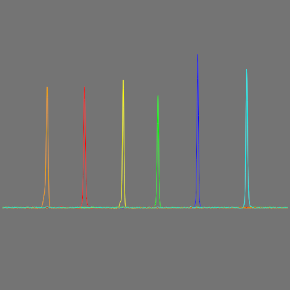

# README



## What's this?

It is software for fragment analysis (MLPA, QF-PCR etc.) data processing.

## Features

FragalyseQt version 0.3.1+ supports assays with up to 8 different dyes used simultaneously,
selective channel hiding, non-Latin run names, can correctly handle damaged files, exports
peaks locations, areas, FWHM's and channel names in CSV for any *.FSA or *.HID files and
exports in CSV internal analysis data for *.FSA of *.HID files generated by ABI 3500 and 
SeqStudio series equipment. Peaks areas are calculated assuming they are Gaussian peaks. For 
noisy runs denoising and baseline correction options is available. All the things are done 
without rewriting any data inside files FragalyseQt works with!

## What file formats are supported?

Currently, only *.FSA and *.HID files are supported. I've tried to add SCF files support, but
SCF supports only 4 fluorescence channels and can't store information about size standard used
for current assay. This renders SCF file format quite obsolete and unusable for modern
assays and thus, this program won't support it.

But, anyway, if you wish to add support for any file format, you may help to implement it
by sending patches.

## What FragalyseQt is useful for?

Currently it is helpful for capillary electrophoresis troubleshooting and not so complex analysis
of sized data obtained using 3500 or SeqStudio family analyzers. If you know precisely your peaks
positions and no sizong is required - you mayuse FragalyseQt for these data analysis too.

## What features are planned for FragalyseQt?

Well, first of all - sizing (a bit laborous work). In future I plan to add bining support to allow
automated genotyping usin FragalyseQt.

## How can I support you?

You may either provide run files from machines I haven't tested FragalyseQt with, provide patches
or support me financially. Either case, contact me by email ( dorif11 AT gmail DOT com ), Telegram
( t.me/nurgle ) or here, at GitHub. Every help is important!

## What's the license of FragalyseQt?

GNU General Public License version 3.

## How to get it working at *ubuntu/Debian/SUSE/macOS?

Install python 3.8+, git and PyQt5/PyQt6/PySide6 (only these Python bindings for Qt are supported)
in any way that is comfortable to you. After this, clone FragalyseQt from Git repository and install
remaining requirements. I propose you to do this using pip:

```bash
git clone https://github.com/Dorif/fragalyseqt && cd fragalyseqt && pip install -r requirements.txt && python3 main.py
```

If you are using something RHEL-based - read next chapters and may the luck be with you.

## How to get it working at RHEL/Oracle 8+?

Prepare enviroment to run FragalyseQt:

```bash
sudo yum install python-qt5 git
```

Download and run FragalyseQt:

```bash
git clone https://github.com/Dorif/fragalyseqt && cd fragalyseqt && pip install -r requirements.txt && python3 main.py
```

## How to get it working at RHEL/CentOS/Oracle/Scientific 7?

These systems have no PyQt5 in their repos, nor you can install PyQt5 at these systems freshly
installed. To install PyQt5 you should first update pip and clean pip cache:

```bash
sudo pip3 install --upgrade pip && rm -rf .pip/cache
```

After that install packages needed for FragalyseQt to work:

```bash
pip3 install pyqt5 && sudo yum install git
```

Download and run FragalyseQt:

```bash
git clone https://github.com/Dorif/fragalyseqt && cd fragalyseqt && pip install -r requirements.txt && python3 main.py
```

## How to get it working at FreeBSD?

First, install Git and libraries needed to run FragalyseQt (assuming you have Python 3.9):

```bash
pkg install git graphics/py-pyqtgraph biology/py-biopython textproc/py-charset-normalizer py39-pip && pip-3.9 install pybaselines
```
Now, download FragalyseQt and run it:

```bash
git clone https://github.com/Dorif/fragalyseqt && cd fragalyseqt && python3.9 main.py
```

Or, if you wish to install all python libraries from PIP (but make sure they are not installed as native packages):

```bash
pkg install git py39-pip && git clone https://github.com/Dorif/fragalyseqt && cd fragalyseqt && pip-3.9 install -r requirements.txt && python3.9 main.py
```

## How to get it working at OpenBSD?

First, install Git and libraries needed to run FragalyseQt:

```bash
pkg_add git py3-pip py3-qt5 py3-pyqtgraph py3-biopython py3-charset-normalizer py3-scipy && pip3 install pybaselines
```
Now, download FragalyseQt and run it:

```bash
git clone https://github.com/Dorif/fragalyseqt && cd fragalyseqt && python3 main.py
```

Or, if you wish to install all python libraries from PIP (but make sure they are not installed as native packages):

```bash
pkg_add git py3-pip && git clone https://github.com/Dorif/fragalyseqt && cd fragalyseqt && pip3 install -r requirements.txt && python3 main.py
```

## How to get it working at NetBSD?

First, install Git and libraries needed to run FragalyseQt. In this case it is essential to install pyqtgraph from PIP, 
because native NetBSD package seems to be broken in some way (assuming you have quite recent version of NetBSD and python 3.11):

```bash
pkg_add git py311-pip py311-qt5 py311-biopython py311-charset-normalizer py311-scipy && pip3.11 install pyqtgraph pybaselines
```

Now, download FragalyseQt and run it:

```bash
git clone https://github.com/Dorif/fragalyseqt && cd fragalyseqt && python3.11 main.py
```

Or, if you wish to install all python libraries from PIP (but make sure they are not installed as native packages):

```bash
pkg_add git py311-pip && git clone https://github.com/Dorif/fragalyseqt && cd fragalyseqt && pip3.11 install -r requirements.txt && python3.11 main.py
```

## Known bad systems.

OpenVMS - has no Qt, no stable Python at least for x86_64 version, forget it.
Solaris/Illumos - SciPy cannot be built and installed.
Haiku - some of its Python related packages seems to be broken, maybe it'll be fixed in future.

## How can I further speed-up FragalyseQt?

If you are using Linux or macOS, you may install Pyston (a performance-optimizing JIT for Python)
for this purpose, it will speed up Python 3.7 - 3.10 compatible applications, not only FragalyseQt:

```bash
pip3 install pyston_lite_autoload
```

## About test files origin.

FSA files from ABI 3100 and HID files from ABI 3500 are from NCBI OSIRIS test file set. NCBI OSIRIS is public domain software.  
NCBI OSIRIS source is available at: https://github.com/ncbi/osiris  
NCBI OSIRIS home page: https://www.ncbi.nlm.nih.gov/osiris/

Files from ABI 310 are from MLPAinter project, licensed under GNU GPL v3.  
MLPAinter source code is available at: https://code.google.com/archive/p/mlpainter/  
MLPAinter publication full text is available at: https://bmcbioinformatics.biomedcentral.com/articles/10.1186/1471-2105-11-67

SeqStudio for GlobalFiler and RapidHIT ID v1.x files are obtained by myself and contain no other persons data.

COrDis Plus files for Nanophore-05 and SeqStudio were provided by Dmitrii Romaniuk, ISB, Moscow and contain no personal data.

Superyears Honor 1616 files were provided by Vadim Ponkratov, "Litolab", Berdsk, Russia and contain no personal data.
