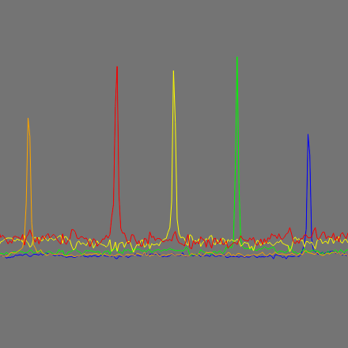
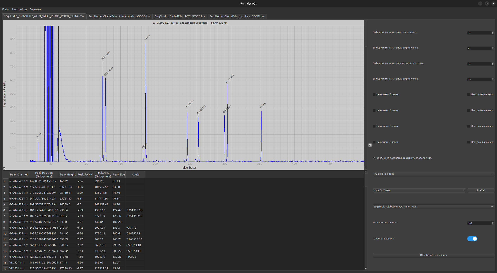

# README



## What's this?

It is software for fragment analysis (MLPA, QF-PCR etc.) data processing.



## Features

FragalyseQt version 0.4+ supports assays with up to 8 different dyes used simultaneously, selective channel
hiding, non-Latin run names, can correctly handle damaged files, exports peaks locations, areas, FWHM's, size
and channel names in CSV for any FSA or HID files and exports in CSV internal analysis data for FSA or HID
files generated by ABI 3500 and SeqStudio series equipment. Since version 0.4.2, FragalyseQt also supports
Global and Local Southern sizing (as described in doi: 10.1016/0003-2697(79)90235-5). Peak areas are
calculated assuming they are Gaussian. For noisy runs denoising and baseline correction options is available.
Since version 0.5, allele binning is supported using panel files from GeneMapper (tab-delimited
`*_Panel*.txt` with optional companion `*_Bins*.txt` and `*_Stutter*.txt`) and GeneMarker (`.xml`).
**NCBI OSIRIS LadderInfo XML** panel files (`.xml`, root element `<KitData>`) are also supported.
When a panel is loaded, sized peaks are automatically assigned allele designations; peaks outside all
known bins are labelled OL (off ladder). When a GeneMapper stutter file or a GeneMarker panel with
stutter ratios is loaded, **stutter peak filtering** is applied automatically: peaks whose height falls
below the panel-defined stutter ratio relative to the adjacent allele are labelled as stutter products.
Note that NCBI OSIRIS panels do not carry stutter ratio data, so stutter filtering is not available
for them. Also since version 0.5, export to **CODIS 3.2 CMF XML** format is supported: open the export
dialog with `Ctrl+Shift+C`, select which samples to include, assign each a specimen category and ID,
fill in lab metadata, and FragalyseQt will generate a schema-valid `CODISImportFile` ready for database
submission. All 29 CODIS specimen categories are supported; locus data is extracted automatically from
loaded panel assignments.
Custom size standards can be added to the library using the **Add size standard** dialog (`Ctrl+Shift+A`):
enter the name, select the ILS channel (Blue/Green/Yellow/Red for DATA1-4, or Orange/Purple/Aqua/Brown for 
extended channels DATA105-108), and provide a space-separated list of sizes. The new standard is saved 
permanently and becomes available for all currently open and future analysis tabs.
Since version 0.5.2, **session save and restore** is supported: save the full state of all open tabs
(parameters, peaks, allele calls) to a local SQLite database via **File → Save Session** (`Ctrl+Shift+S`)
and reopen it later with **File → Open Session** (`Ctrl+Shift+O`). Sessions are tied to the original files
by four independent hash algorithms (MD5, SHA-1, SHA-256, SHA-3/256); if a source file is missing or has
been modified, the session opens in **read-only mode** with the stored data still available for export.
Also since 0.5.2, a **SOAP API** for LIMS and web-tool integration is available via
**Settings → SOAP API…** — enable it to expose analysis results and session operations over HTTP on
a configurable local port (default 8742). The WSDL is served at `/FragalyseQtService?wsdl`.
All the things are done without rewriting any data inside files FragalyseQt works with!

## What file formats are supported?

Currently, FSA and HID files are supported and (as of version 0.4.3) very experimental support (not suitable for
sizing, viewing only) for native Nanophore-05 FRF files is added.

If you wish to add support for any file format, you may help to implement it by sending patches.

## What FragalyseQt is useful for?

Currently it is helpful for capillary electrophoresis troubleshooting, peak detection and sizing and, thus is
applicable for quite a wast amount of different work.

Because FragalyseQt analyses raw capillary electrophoresis data, you may obtain peak areas different from true ones
if your peaks are crowded (like in TP-PCR or at allelic ladders). In this case you MUST use baseline correction and
denoising option.

FragalyseQt makes no changes in analysed files, so if you wish to save analysis results - you must export them in CSV.

## FragalyseQt hotkeys.
`Ctrl+O` — open file for analysis.

`Ctrl+E` — export analysis results in CSV.

`Ctrl+Shift+E` — export all open tabs to CSV files in a chosen folder.

`Ctrl+Shift+S` — save current session (all open tabs) to database.

`Ctrl+Shift+O` — open a previously saved session from database.

`Ctrl+I` — export internal analysis in CSV (ABI 3500 and SeqStudio series only).

`Ctrl+Shift+C` — export to CODIS 3.2 CMF XML.

`Ctrl+Shift+A` — add custom size standard.

`Ctrl+W` — close current tab.

`F1` — About.

## Saving and restoring sessions

**File → Save Session** (`Ctrl+Shift+S`) saves the complete state of all open tabs — peak detection
parameters, sizing method, panel selection, and all detected peaks with allele calls — into a local
SQLite database (`~/.local/share/fragalyseqt/sessions.db` on Linux).

**File → Open Session** (`Ctrl+Shift+O`) lists saved sessions and restores them. Before opening,
FragalyseQt verifies the source files against stored hashes:

- If all files are intact, the session opens normally and analysis is re-run with the stored parameters.
- If any file is missing or modified, a verification dialog explains what changed and offers to open in
  **read-only mode** — the stored peak table and allele calls remain available for viewing and export
  even without the original files.

Sessions are identified by name; saving with the same name supersedes the previous version while
keeping the full history in the database.

## SOAP API

FragalyseQt includes a built-in SOAP 1.1 server for integration with LIMS and laboratory web tools.
Enable it in **Settings → SOAP API** and configure the port (default 8742) and optional access token.

Once enabled, the service is available at `http://localhost:8742/FragalyseQtService` with the WSDL
at `?wsdl`. Supported operations include reading peak tables and allele calls, triggering reanalysis,
submitting files for analysis, and saving/restoring sessions — all usable from any SOAP client.

A test client script is provided in `contrib/soap_test_client.py` (requires `python3-zeep`).

## What features are planned for FragalyseQt?

Currently, I plan to further improve binning, genotyping support, CODIS export coverage, and add
PostgreSQL and ImmuDB database backends for multi-user and high-stakes forensic workflows.

## How can I support you?

You may either provide run files from machines I haven't tested FragalyseQt with, provide patches or support me
financially. Either case, contact me by email ( dorif11 AT gmail DOT com ), Telegram ( t.me/nurgle ) or here, at
GitHub. Every help is important!

## What's the license of FragalyseQt?

GNU GPL v3 for versions prior to 0.4.x. GNU AGPL v3 for versions from 0.4 and up.

## Installation from pre-built packages

Pre-built DEB and RPM packages are available on the
[releases page](https://github.com/Dorif/fragalyseqt/releases).

### DEB (Debian, Ubuntu, Linux Mint and derivatives)

Download the `.deb` file and install it with `apt`:

```bash
sudo apt install ./fragalyseqt_0.5.2_all.deb
```

This resolves and installs all dependencies automatically.

### RPM (openSUSE 16+/Tumbleweed/Slowrolling, Alt Linux, Fedora, RHEL 8+ and derivatives)

First of all, if you are using Fedora/RHEL derivatives -
enable EPEL repository for you distro - you'll need it.

Download the `.rpm` file and install it with `dnf`:

```bash
sudo dnf install -y ./fragalyseqt-0.5.2-1.noarch.rpm
```

On older RHEL/CentOS 8 systems use `yum`:

```bash
sudo yum install -y ./fragalyseqt-0.5.2-1.noarch.rpm
```

On openSUSE 16, Tumbleweed or Slowrolling:

```bash
sudo zypper install -y ./fragalyseqt-0.5.2-1.noarch.rpm
```

On AltLinux:

```bash
sudo apt-get install -y ./fragalyseqt-0.5.2-2.altlinux.noarch.rpm
```

## How to get it working at general Linux/macOS/Windows?

Install Python 3.8+, git and PyQt5/PyQt6/PySide6 (only these Python bindings for Qt are supported) in any way that
is comfortable to you. After this, clone FragalyseQt from Git repository, install and run it. I propose you to do
this using pip3:

```bash
git clone https://github.com/Dorif/fragalyseqt && cd fragalyseqt && pip3 install . && fragalyseqt
```

If you get externally-managed-environment error, try:

```bash
pip3 install --break-system-packages .
```

It actually won't break anything in normal case.

Alternatively, you may try to set up virtual environment or use pipx, but previously mentioned option is recommended.

If you are using something RHEL-based - read next chapters and may the luck be with you.

## How to get it working at RHEL/CentOS/Alma/Rocky/Oracle/Scientific 7?

These systems have no PyQt5 in their repos, nor you can install PyQt5 at these systems freshly
installed. To install PyQt5 you should first update pip3 and clean pip cache:

```bash
sudo pip3 install --upgrade pip && rm -rf .pip/cache
```

After that install packages needed for FragalyseQt to work:

```bash
pip3 install pyqt5 && sudo yum install git
```

Download, install and run FragalyseQt:

```bash
git clone https://github.com/Dorif/fragalyseqt && cd fragalyseqt && pip install . && fragalyseqt
```

## How to get it working at FreeBSD?

First, install Git and libraries needed to run FragalyseQt (assuming you have Python 3.9):

```bash
pkg install git graphics/py-pyqtgraph biology/py-biopython textproc/py-charset-normalizer py39-pip
```
Now, download FragalyseQt, install and run it:

```bash
git clone https://github.com/Dorif/fragalyseqt && cd fragalyseqt && pip-3.9 install . && fragalyseqt
```

Or, if you wish to install all python libraries from PIP (but make sure they are not installed as native packages):

```bash
pkg install git py39-pip && git clone https://github.com/Dorif/fragalyseqt && cd fragalyseqt && pip-3.9 install . && fragalyseqt
```

## How to get it working at OpenBSD?

First, install Git and libraries needed to run FragalyseQt:

```bash
pkg_add git py3-pip py3-qt5 py3-pyqtgraph py3-biopython py3-charset-normalizer py3-scipy
```
Now, download FragalyseQt, install and run it:

```bash
git clone https://github.com/Dorif/fragalyseqt && cd fragalyseqt && pip3 install . && fragalyseqt
```

Or, if you wish to install all python libraries from PIP (but make sure they are not installed as native packages):

```bash
pkg_add git py3-pip && git clone https://github.com/Dorif/fragalyseqt && cd fragalyseqt && pip3 install . && fragalyseqt
```

## How to get it working at NetBSD?

First, install Git and libraries needed to run FragalyseQt. In this case it is essential to install pyqtgraph by pip, because
native NetBSD package seems to be broken in some way (assuming you have quite recent version of NetBSD and python 3.11):

```bash
pkg_add git py311-pip py311-qt5 py311-biopython py311-charset-normalizer py311-scipy && pip3.11 install pyqtgraph
```

Now, download FragalyseQt, install and run it:

```bash
git clone https://github.com/Dorif/fragalyseqt && cd fragalyseqt && pip3.11 install . && fragalyseqt
```

Or, if you wish to install all python libraries from PIP (but make sure they are not installed as native packages):

```bash
pkg_add git py311-pip && git clone https://github.com/Dorif/fragalyseqt && cd fragalyseqt && pip3.11 install . && fragalyseqt
```

## Will it run at non-x86 machines?

Yes, it will, because it is cross-platform not only in terms of OS, but also in terms of hardware. At least it was run
at RISC-V and ARM based machines.

## Known bad systems.

OpenVMS - has no Qt, no stable Python at least for x86_64 version, forget it.
Solaris/Illumos - SciPy cannot be built and installed.
Haiku - pyqtgraph package seems to be broken (resolves with installation by pip), SciPy package is compiled without ndimage 
module and fails to install by pip, maybe this will be fixed in future.

## How to select size standard for sizing?

It may be counterintuitive, but sometimes you MUST use size standard other, than detected and shown on screen
right above CE data plot.

Here are some hints how to select correct size standard:

If you see LIZ/CC5/WEN/BTO/other channel 5 ladder is written above data plot, but no LIZ/CC5/WEN/BTO channel data are
available - choose ROX/CXR/other channel 4 ladder upon your kit and equipment specifications. Example: all sample files
for Profiler Plus, CoFiler and PowerPlex 16.

Choose ladder subsets with skipped low size markers like GS600LIZ(60-600) if you have strong noise in that area, affecting
even ladder channel.

## How to select sizing algorhythm and sizecall my data?

Fastest and least resource consuming with moderate precision is Linear Spline. Choose it if you have extremely weak system like
an old netbook or first Raspberry Pi.

Most balanced are Cubic Spline and Local Southern.

5th degree spline may be a bit more precise than Cubic.

However, Cubic and 5th degree Splines are suffering from Runge phenomenon, making them about unusable for very small or very big sizes.

If you wish more sizing uniformity - use LSQ weighted spline sizing. Its precision grows from 1st to 5th order. The same way grows
resource consumption.

Pure LSQ calling is good at calling highly multiplexed and noisy data with some degree of anomalous migration.

Hit "SizeCall" button each time you change peak detection settings, apply baseline correction and denoising, hide/show channel or open
new file.

## Batch processing

When multiple files from the same run or reagent kit are open simultaneously, you can apply the same
analysis parameters to all tabs at once without configuring each one individually. Set up peak detection
parameters, size standard, sizing method, panel, baseline correction, and channel visibility on any tab,
then click the **Process whole batch** button at the bottom of the control panel. All other open tabs will
be updated with the same settings and reanalysed immediately.

## Exporting all open files at once

To export analysis results for all open tabs in a single operation, use **File → Export whole session**
(`Ctrl+Shift+E`). You will be prompted to choose or create a destination folder. FragalyseQt will write
one CSV file per tab, named after the original FSA/HID/FRF file but with a `.csv` extension
(e.g. `sample.fsa` → `sample.csv`). If two open files share the same base name (files from different
directories), a numeric suffix is appended to avoid overwriting (`sample.csv`, `sample_2.csv`, etc.).

## About test files origin.

FSA files from ABI 3100 and HID files from ABI 3500 are from NCBI OSIRIS test file set. NCBI OSIRIS is public domain software.  
NCBI OSIRIS source is available at: https://github.com/ncbi/osiris  
NCBI OSIRIS home page: https://www.ncbi.nlm.nih.gov/osiris/

Files from ABI 310 are from MLPAinter project, licensed under GNU GPL v3.  
MLPAinter source code is available at: https://code.google.com/archive/p/mlpainter/  
MLPAinter publication full text is available at: https://bmcbioinformatics.biomedcentral.com/articles/10.1186/1471-2105-11-67

NIST STR files are from NIST Forensic DNA Open Dataset v. 1.3.0 also available at: https://data.nist.gov/od/id/mds2-2157/pdr:v/1.3.0
NIST mixtures STR files are from NIST Forensic DNA Open Dataset v. 1.4.1 also available at: https://data.nist.gov/od/id/mds2-2157/pdr:v/1.4.1
Copyright notice added in correspondent directory according with Fair Use of Other NIST Data/Works policy:
https://www.nist.gov/open/copyright-fair-use-and-licensing-statements-srd-data-software-and-technical-series-publications
Panel files shipped within those datasets are shipped in a separate directory to avoid files duplication.

SeqStudio for GlobalFiler and RapidHIT ID v1.x files are obtained by myself and contain no other persons data.

COrDis Plus files for Nanophore-05 and SeqStudio were provided by Dmitrii Romaniuk, ISB, Moscow and contain no personal data.

Superyears Honor 1616 files were provided by Vadim Ponkratov, "Litolab", Berdsk, Russia and contain no personal data.
