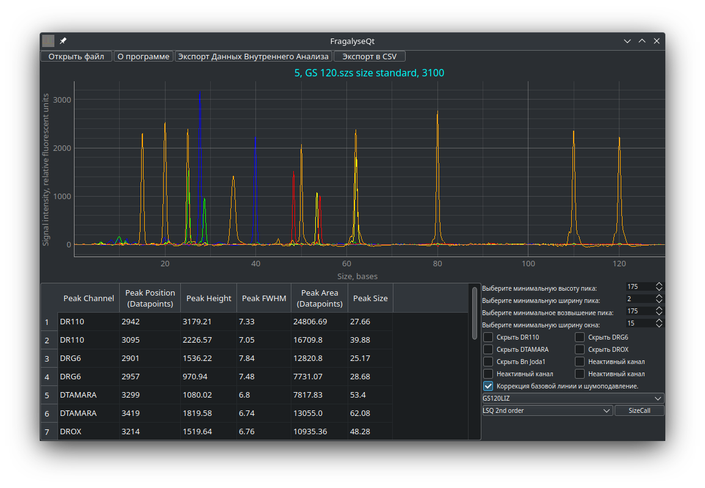

# README


## What's this?

It is software for fragment analysis (MLPA, QF-PCR etc.) data processing.



## Features

FragalyseQt version 0.4+ supports assays with up to 8 different dyes used simultaneously, selective channel
hiding, non-Latin run names, can correctly handle damaged files, exports peaks locations, areas, FWHM's, size
and channel names in CSV for any FSA or HID files and exports in CSV internal analysis data for FSA or HID
files generated by ABI 3500 and SeqStudio series equipment. Peak areas are calculated assuming they are
Gaussian. For noisy runs denoising and baseline correction options is available. All the things are done
without rewriting any data inside files FragalyseQt works with!

## What file formats are supported?

Currently, only FSA and HID files are supported. I've tried to add SCF files support, but it supports only 4
fluorescence channels and can't store information about size standard used for current assay. This renders
SCF file format quite obsolete and unusable for modern assays and thus, this program won't support it.

But, anyway, if you wish to add support for any file format, you may help to implement it by sending patches.

## What FragalyseQt is useful for?

Currently it is helpful for capillary electrophoresis troubleshooting, peak detection and sizing and, thus is
applicable for quite a wast amount of different work.

Because FragalyseQt analyses raw capillary electrophoresis data, you may obtain peak areas different from true ones
if your peaks are crowded (like in TP-PCR or at allelic ladders). In this case you MUST use baseline correction and
denoising option.

FragalyseQt makes no changes in analysed files, so if you wish to save analysis results - you must export them in CSV.

## What features are planned for FragalyseQt?

Currently, I plan to add bining support to allow automated genotyping using FragalyseQt.

## How can I support you?

You may either provide run files from machines I haven't tested FragalyseQt with, provide patches or support me
financially. Either case, contact me by email ( dorif11 AT gmail DOT com ), Telegram ( t.me/nurgle ) or here, at
GitHub. Every help is important!

## What's the license of FragalyseQt?

GNU GPL v3 for versions prior to 0.4.x. GNU AGPL v3 for versions from 0.4 and up.

## How to get it working at *ubuntu/Debian/SUSE/macOS?

Install Python 3.8+, git and PyQt5/PyQt6/PySide6 (only these Python bindings for Qt are supported) in any way that
is comfortable to you. After this, clone FragalyseQt from Git repository and install remaining requirements.
I propose you to do this using pip:

```bash
git clone https://github.com/Dorif/fragalyseqt && cd fragalyseqt && pip install -r requirements.txt && python3 main.py
```

If you get externally-managed-environment error, try:

```bash
pip install --break-system-packages -r requirements.txt && python3 main.py
```

It actually won't break anything in normal case.

Alternatively, you may try to set up virtual environment or use pipx, but previously mentioned option is recommended.

If you are using something RHEL-based - read next chapters and may the luck be with you.

## How to get it working at AltLinux?

Prepare enviroment to run FragalyseQt (GCC and python3-dev are needed to build BioPython):

```bash
su -c "apt-get install -y git gcc python3-module-pip python3-module-scipy python3-module-numpy-testing python3-dev"
```

Download and run FragalyseQt:

```bash
git clone https://github.com/Dorif/fragalyseqt && cd fragalyseqt && pip install -r requirements.txt && python3 main.py
```

## How to get it working at RHEL/Oracle 8+?

Prepare enviroment to run FragalyseQt:

```bash
sudo yum install python-qt5 git
```

Download and run FragalyseQt:

```bash
git clone https://github.com/Dorif/fragalyseqt && cd fragalyseqt && pip install -r requirements.txt && python3 main.py
```

## How to get it working at RHEL/CentOS/Oracle/Scientific 7?

These systems have no PyQt5 in their repos, nor you can install PyQt5 at these systems freshly
installed. To install PyQt5 you should first update pip and clean pip cache:

```bash
sudo pip3 install --upgrade pip && rm -rf .pip/cache
```

After that install packages needed for FragalyseQt to work:

```bash
pip3 install pyqt5 && sudo yum install git
```

Download and run FragalyseQt:

```bash
git clone https://github.com/Dorif/fragalyseqt && cd fragalyseqt && pip install -r requirements.txt && python3 main.py
```

## How to get it working at FreeBSD?

First, install Git and libraries needed to run FragalyseQt (assuming you have Python 3.9):

```bash
pkg install git graphics/py-pyqtgraph biology/py-biopython textproc/py-charset-normalizer py39-pip &&\\
pip-3.9 install pybaselines
```
Now, download FragalyseQt and run it:

```bash
git clone https://github.com/Dorif/fragalyseqt && cd fragalyseqt && python3.9 main.py
```

Or, if you wish to install all python libraries from PIP (but make sure they are not installed as native packages):

```bash
pkg install git py39-pip && git clone https://github.com/Dorif/fragalyseqt && cd fragalyseqt &&\\
pip-3.9 install -r requirements.txt && python3.9 main.py
```

## How to get it working at OpenBSD?

First, install Git and libraries needed to run FragalyseQt:

```bash
pkg_add git py3-pip py3-qt5 py3-pyqtgraph py3-biopython py3-charset-normalizer py3-scipy && pip3 install pybaselines
```
Now, download FragalyseQt and run it:

```bash
git clone https://github.com/Dorif/fragalyseqt && cd fragalyseqt && python3 main.py
```

Or, if you wish to install all python libraries from PIP (but make sure they are not installed as native packages):

```bash
pkg_add git py3-pip && git clone https://github.com/Dorif/fragalyseqt && cd fragalyseqt &&\\
pip3 install -r requirements.txt && python3 main.py
```

## How to get it working at NetBSD?

First, install Git and libraries needed to run FragalyseQt. In this case it is essential to install pyqtgraph by pip, because
native NetBSD package seems to be broken in some way (assuming you have quite recent version of NetBSD and python 3.11):

```bash
pkg_add git py311-pip py311-qt5 py311-biopython py311-charset-normalizer py311-scipy &&\\
pip3.11 install pyqtgraph pybaselines
```

Now, download FragalyseQt and run it:

```bash
git clone https://github.com/Dorif/fragalyseqt && cd fragalyseqt && python3.11 main.py
```

Or, if you wish to install all python libraries from PIP (but make sure they are not installed as native packages):

```bash
pkg_add git py311-pip && git clone https://github.com/Dorif/fragalyseqt && cd fragalyseqt && \\
pip3.11 install -r requirements.txt && python3.11 main.py
```

## Will it run at non-x86 machines?

Yes, it will, because it is cross-platform not only in terms of OS, but also in terms of hardware. At least it was run
at RISC-V and ARM based machines.

## Known bad systems.

OpenVMS - has no Qt, no stable Python at least for x86_64 version, forget it.
Solaris/Illumos - SciPy cannot be built and installed.
Haiku - pyqtgraph package seems to be broken (resolves with installation by pip), SciPy package is compiled without ndimage 
module and fails to install by pip, maybe this will be fixed in future.

## How can I further speed-up FragalyseQt?

If you are using Linux or macOS, you may install Pyston (a performance-optimizing JIT for Python)
for this purpose, it will speed up Python 3.7 - 3.10 compatible applications, not only FragalyseQt:

```bash
pip3 install pyston_lite_autoload
```

## How to select size standard for sizing?

It may be counterintuitive, but sometimes you MUST use size standard other, than detected and shown on screen
right above CE data plot.

Here are some hints how to select correct size standard:

If you see LIZ/CC5/WEN/BTO/other channel 5 ladder is written above data plot, but no LIZ/CC5/WEN/BTO channel data are
available - choose ROX/CXR/other channel 4 ladder upon your kit and equipment specifications. Example: all sample files
for Profiler Plus, CoFiler and PowerPlex 16.

If you see limited ladder subset like GS600LIZ(60-460), but you see peaks obviously bigger than this ladder upper
limit - count peak number and select ladder with highest peak size among counted. Example: in SeqStudio GlobalFiler files,
shipped as example, GS600LIZ(60-460) ladder is detected, but in fact there are all ladder peaks up to 600 nucleotides,
so you MUST use either GS600LIZ, GS600LIZ(60-600), GS600LIZ(80-600) or GS600LIZ(100-600) ladder for sizing.

Choose ladder subsets with skipped low size markers like GS600LIZ(60-600) if you have strong noise in that area, affecting
even ladder channel.

Choose minus peak ladders subsets like GS600LIZ-250 ONLY if correspondent peaks failed to inject.

## How to select sizing algorhythm and sizecall my data?

Fastest and least resource consuming with moderate precision is Linear Spline. Choose it if you have extremely weak system like
an old netbook or first Raspberry Pi.

Most balanced is Cubic Spline.

5th degree spline may be a bit more precise than Cubic.

However, Cubic and 5th degree Splines are suffering from Runge phenomenon, making them about unusable for very small or very big sizes.

If you wish more sizing uniformity - use LSQ weighted spline sizing. Its precision grows from 1st to 5th order. The same way grows
resource consumption.

Pure LSQ calling is good at calling highly multiplexed and noisy data with some degree of anomalous migration.

Hit "SizeCall" button each time you change peak detection settings, apply baseline correction and denoising, hide/show channel or open
new file.

## About test files origin.

FSA files from ABI 3100 and HID files from ABI 3500 are from NCBI OSIRIS test file set. NCBI OSIRIS is public domain software.  
NCBI OSIRIS source is available at: https://github.com/ncbi/osiris  
NCBI OSIRIS home page: https://www.ncbi.nlm.nih.gov/osiris/

Files from ABI 310 are from MLPAinter project, licensed under GNU GPL v3.  
MLPAinter source code is available at: https://code.google.com/archive/p/mlpainter/  
MLPAinter publication full text is available at: https://bmcbioinformatics.biomedcentral.com/articles/10.1186/1471-2105-11-67

NIST STR files are from NIST Forensic DNA Open Datadset v. 1.3.0 also available at: https://data.nist.gov/od/id/mds2-2157/pdr:v/1.3.0
Copyright notice added in correspondent directory according with Fair Use of Other NIST Data/Works policy:
https://www.nist.gov/open/copyright-fair-use-and-licensing-statements-srd-data-software-and-technical-series-publications
Only HID files from NIST dataset are kept, all other files are removed.

SeqStudio for GlobalFiler and RapidHIT ID v1.x files are obtained by myself and contain no other persons data.

COrDis Plus files for Nanophore-05 and SeqStudio were provided by Dmitrii Romaniuk, ISB, Moscow and contain no personal data.

Superyears Honor 1616 files were provided by Vadim Ponkratov, "Litolab", Berdsk, Russia and contain no personal data.
